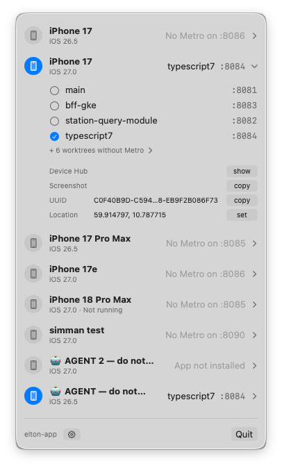

# SimMan

SimMan (Sim Manager) is a macOS menu bar app for developers who run one Expo app from several git worktrees at once. It shows which worktree each booted iOS simulator loads its JavaScript from. One click points a simulator at another worktree.



## The problem it solves

A [git worktree](https://git-scm.com/docs/git-worktree) is an extra checkout of a repository in its own folder, so you can keep several branches open side by side. In an Expo project, each worktree can run its own Metro server on its own port. Metro is the dev server that bundles the app's JavaScript. A [development build](https://docs.expo.dev/develop/development-builds/introduction/) in a simulator loads its bundle from one of those servers.

With three Metro servers and four simulators, it is easy to lose track of which simulator runs which branch. The Expo dev menu inside the app shows a port, not the worktree behind it. To switch, you open the dev menu in that simulator and pick another server.

## Requirements

- macOS 14 or later.
- Xcode 16 or later. SimMan builds with Swift 6 and controls simulators through `xcrun simctl`.
- An Expo project in a git repository.
- A development build of that project (`expo-dev-client`) installed in the simulators. SimMan doesn't support Expo Go.

## Install

Download `SimMan-<version>.zip` from the [latest release](https://github.com/js/simman/releases/latest), unzip it, and move `SimMan.app` to `/Applications`. Releases run on Apple silicon only. SimMan isn't notarized, so macOS blocks the first launch. To allow it, run:

```sh
xattr -dr com.apple.quarantine /Applications/SimMan.app
```

To build from source instead:

```sh
git clone https://github.com/js/simman.git
cd simman
make install
open /Applications/SimMan.app
```

`make install` builds a release version and copies it to `/Applications`. It asks for `sudo` only if you can't write to that folder.

## Use it

1. The first time SimMan starts, its Settings window opens. Choose your Expo project's folder. SimMan reads the app's bundle ID from `ios/` or `app.json`.
2. Start Metro in the worktrees you want, for example with `npx expo start --port 8082`.
3. Click the iPhone icon in the menu bar.

The menu has one row per booted simulator. Each row shows the simulator's name and iOS version, and the worktree and port the app last loaded. While the menu is open, it refreshes every two seconds.

Click a row to expand it. The expanded row lists the worktrees that have a running Metro server. Click one to relaunch the app in that simulator, pointed at that worktree's server. SimMan hides worktrees without a running server behind a disclosure.

The expanded row also has these actions:

- **Device Hub** opens the simulator in Device Hub, which comes with Xcode 27 and later.
- **Screenshot** copies a screenshot of the simulator to the clipboard.
- **UUID** copies the simulator's identifier.
- **Location** sets the simulator's location to the coordinates in Settings.

To change the project or the location, click the gear button at the bottom of the menu.

## How it works

- **Worktrees** come from `git worktree list`.
- **Metro servers** are listening TCP ports whose process runs in a worktree's root folder and that answer Metro's `/status` request.
- **The current server** comes from the dev launcher. It records each bundle URL it opens, with a timestamp, in the app's preferences inside the simulator. SimMan reads the newest entry.
- **Switching** runs `xcrun simctl launch --terminate-running-process <simulator> <bundle ID> --initialUrl http://127.0.0.1:<port>`. The dev launcher reads `--initialUrl` at startup.

## Limits

- SimMan manages one project at a time, and the project must be a git repository.
- If the bundle ID is set only in a dynamic `app.config.js`, run `npx expo prebuild` first, so `ios/` exists.
- Switching restarts the app, so the app loses its in-app state, as it does with a switch from the dev menu.
- The menu shows the last bundle the dev launcher loaded. After **Go home** in the dev menu, it still names that bundle.

## Development

`make build` builds a debug version into `build/debug/SimMan.app`. `make run` builds it, quits any running SimMan, and opens the new build.

`make release` asks for a new tag and shows the previous one. It builds a release version, zips it, and has Claude Code write release notes from the commits since the previous tag. After you review or edit the notes, it pushes the tag and publishes a GitHub release with the zip attached. It needs the `gh` and `claude` command line tools.
